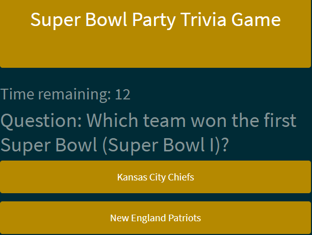

# TriviaGame

## Screenshot

## Live
<a href="https://philipstubbs13.github.io/TriviaGame/index.html" target="_blank">https://philipstubbs13.github.io/TriviaGame/index.html</a>

## Technologies used to create game
* HTML5
* CSS
* Bootstrap 4.0.0-beta
* Javascript
* JQuery

## How to play
<ul>
	<li>The trivia game includes 10 questions.</li>
	<li>The theme of the game is Super Bowl trivia. So, you might want to brush up on your Super Bowl history before playing.</li>
	<li>To start playing, click <b>Start</b>.</li>
	<li>You have 15 seconds to answer each question. When the timer reaches 0, your time is up, and the game will move to the next question.</li>
	<li>The game counts running out of time on a question as an incorrect answer. So, don't think too much for too long. If you don't know the answer to a question, just guess.</li>
	<li>After you go through all the questions, you will find out your score. If you want, you will have the opportunity to play again to improve that score.</li>
</ul>

## Feedback

Feel free to send feedback via [Twitter](https://twitter.com/iamPhilStubbs), email (philipstubbs13@gmail.com), or [file an issue](https://github.com/philipstubbs13/TriviaGame/issues/new). Feature requests are always welcome. If you wish to contribute, please send an email with your request to philipstubbs13@gmail.com to discuss.

