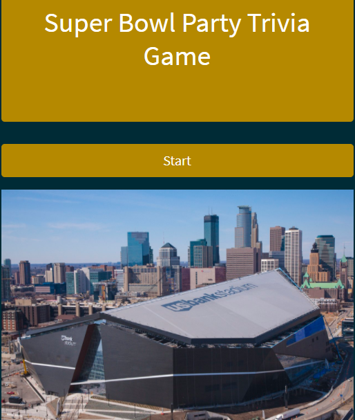
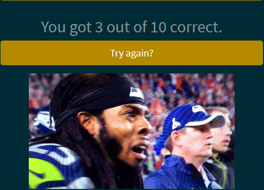

# TriviaGame

## Overview

This app is a trivia game that was created using JavaScript for the logic and jQuery to manipulate the HTML. Specifically, the trivia questions, possible answers/choices, correct answers, and images are stored in an array. A count variable was created to keep track of the index of the currently displayed trivia question. When the game starts, the count variable starts at 0. The game will display a question and the list of choices for that question based on the value of the count variable. For each question answered (or not answered), the count goes up by 1. The app also uses a timer. Specifically, it uses the setInterval method to decrement the timer every 1 second and the clearInterval method to stop the timer when it reaches 0. When the timer reaches 0, the current question and choices are hidden from the HTML, and the next question will appear after a few seconds of delay. As you go through the questions in the game, the app keeps track of the number of correct answers with the correctAnswersTally variable and the number of incorrect answers with the incorrectAnswersTally variable. If the incorrect answer is chosen, it was decided to not show the correct answer during the game. When the game is over (no more questions are left), the app displays the value of the correctAnswersTally variable to the user. A "Try again?" button is appended to the page so that the user can play again to improve upon his/her score. The app also uses Bootstrap for styling and layout.

## Screenshots

## Live
<a href="https://philipstubbs13.github.io/TriviaGame/index.html" target="_blank">https://philipstubbs13.github.io/TriviaGame/index.html</a>

## Technologies used to create game
* HTML5
* CSS
* Bootstrap 4.0.0-beta
* Javascript
* JQuery

## How to play
<ul>
	<li>The trivia game includes 10 questions.</li>
	<li>The theme of the game is Super Bowl trivia. So, you might want to brush up on your Super Bowl history before playing.</li>
	<li>To start playing, click <b>Start</b>.</li>
	<li>You have 15 seconds to answer each question. When the timer reaches 0, your time is up, and the game will move to the next question.</li>
	<li>The game counts running out of time on a question as an incorrect answer. So, don't think too much for too long. If you don't know the answer to a question, just guess.</li>
	<li>After you go through all the questions, you will find out your score. If you want, you will have the opportunity to play again to improve that score.</li>
</ul>

## Future feature enhancements 
<ul>
	<li>Replace imageCorrect images with gifs using the giphy API. So, when a user gets a question right, show gif rather than static image.</li>
	<li>Add more questions.</li>
	<li>Replace image on start screen with better image.</li>
	<li>When user gets 100% correct, a gif shows at end of game. Update gif.</li>
</ul>

## Feedback

Feel free to send feedback via <a href="https://twitter.com/iamPhilStubbs" target="_blank">Twitter</a>, email (philipstubbs13@gmail.com), or <a href="https://github.com/philipstubbs13/TriviaGame/issues/" target="_blank">file an issue</a>. Feature requests are always welcome. If you wish to contribute, please send an email with your request to philipstubbs13@gmail.com to discuss.

